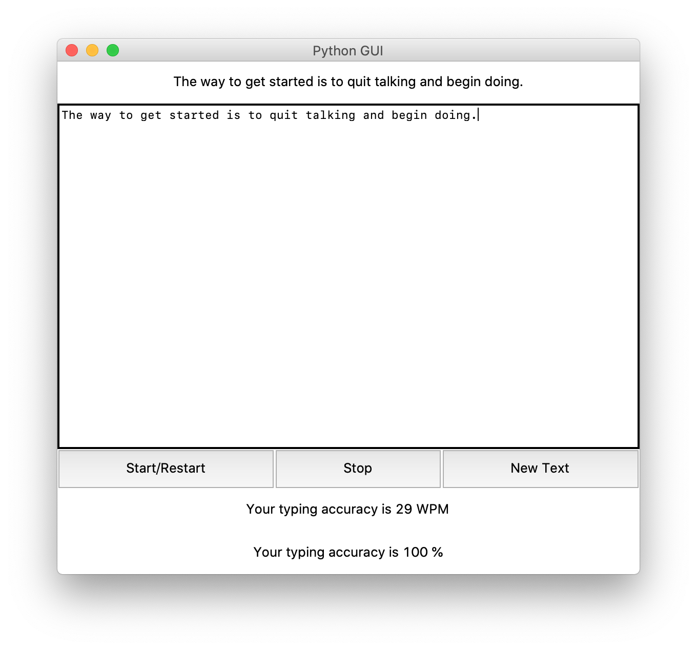
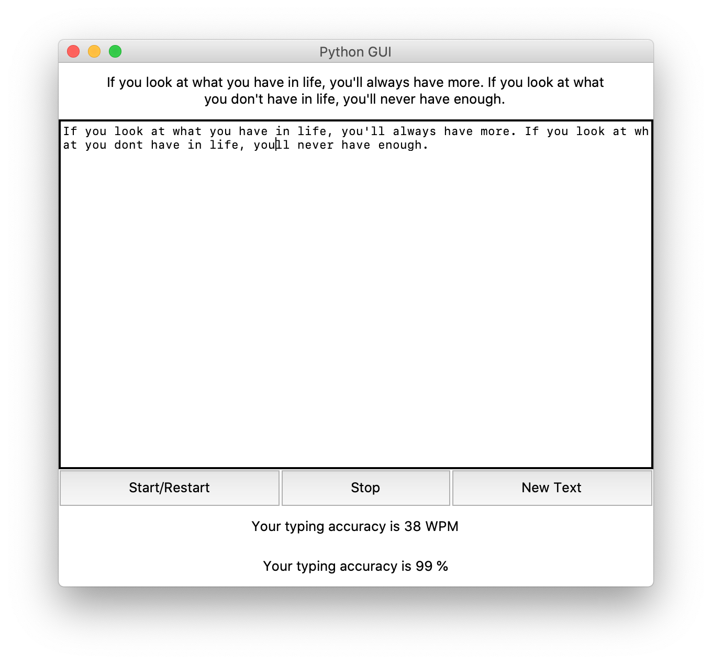

# Typing Speed Calculator.



## This is a GUI based Python Program which measures your Typing speed.
<br>

 ## Install
  Executable Application on Windows:
  ```
  - Download this repository on local machine.
  - Extract typing_speed_test repository on local machine and open typing_speed_test folder
  - Give required permissions and Enjoy the typing_speed_testApplication.
  ```

  Python Code On windows machine:

  clone typing_speed_test.py repository on local machine.
  ```
  >git clone https://github.com/geosaleh/typing_speed_test
  ```
  change directory to typing_speed_test
  ```
  > cd typing_speed_test/
  ```

Now its time to execute **typing_speed_test.py**
```
>python typing_speed_test.py
```
it will show following Output


## Download
:paperclip: [Download Here](https://github.com/geosaleh/typing_speed_test/archive/refs/heads/master.zip)

Hope you'll install it in your computer just to try .

